# Augmented Analytics for HR_analysis

## Introduction
One of the more sophisticated features of Oracle’s self-service offering is the ability to leverage advanced analytics and machine learning at the click of a button directly from your self-service projects and data flows. The machine learning features include a set of pre-built algorithms which can be used to extract insights from your data sets such as sentiment analysis, time-series analysis, prediction outcomes and confidence scores.

Advanced analytics functions such as forecasting, trend analysis and clustering can be applied to a visualization within your canvas with one-click. Additionally, users can call custom machine learning scripts either using the evaluate script function from within your self-service projects, or by adding custom scripts as part of your data flow when preparing data.

*Estimated Time:* 30 Minutes.

### Video Preview
  

### Objectives
* This exercise will introduce you to OAS augmented analytics such as Explain feature, outlier identification, etc.
* You will explore OAS predictive analytics using built-in  machine learning algorithms.
* In this lab, you will play the role of an HR Analyst. The VP of HR has noticed an increasing rate of attrition.  
* As an analyst, you have been tasked with identifying what is happening internally in order to decrease the rate of attrition and identify potential strategies to mitigate risk. Additionally, you will identify those employees who are at greatest risk for leaving.   

### Prerequisites
This lab assumes you have:
- A Free Tier, Paid or LiveLabs Oracle Cloud account
- You have completed:
    - Lab: Prepare Setup (*Free-tier* and *Paid Tenants* only)
    - Lab: Environment Setup
    - Lab: Initialize Environment

## Task 1: Using Machine Learning to Accelerate Root Cause Analysis
In this exercise we are going to import a data set containing a number of employee records with various attributes that record employee experience, performance, and incentive. The data is historical in nature and includes a data element that identifies whether the employee has left the organization.  

  - Note the attrition column, a binary indicator.  
  - Each employee record contains either a *“yes”* or a *“no”* response.

Once you have imported your data into Oracle Analytics, you begin with data profiling, and reviewing semantic recommendations in order to repair and enrich your data for further analysis. Next you will leverage an augmented analytics capability called *explain*. Explain is used to generate insights via a combination of natural language processing, descriptive statistics and predictive modeling techniques in order to better understand our data and obtain deeper insights, pre-analysis.

1. From the browser session you started in [Lab: Initialize Environment](?lab=init-start-oas), go to the landing page, click on create button and select Create .. Workbook.

    

2. Select Create Dataset.  

    

3. Add the data set. From the Documents / Live Labs Content directory, select the file *“Attrition Training v3.xlsx”*

    

    Now **add** the dataset to the workbook as follows.  

    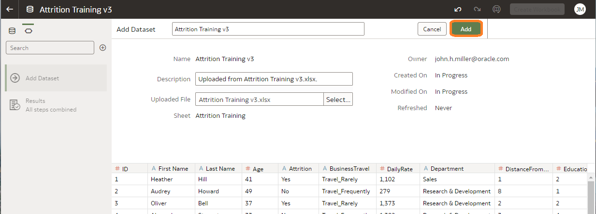

4. Now locate the *ID* column and click the column-level hamburger icon at the top and let's Hide this column since the *ID* column clearly has no bearing on whether an employee stays or leaves our organization.  
   **Note**: this same procedure can be applied to any column you suspect has no bearing on attrition.  

    

    Likewise, find the *Age* column  and using the properties panel in the lower left hand corner change "Treat As" to Attribute and "Data Type" to Text.  Reason for doing so is the Age of an employee may indeed have bearing on attrition so evaluating each distinct Age of an employee could be deterministic.  

    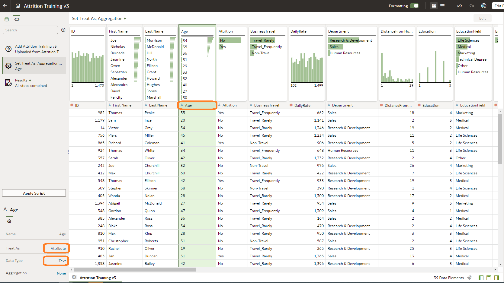

    Oracle Analytics surfaces a set of helpful column transformation termed “Recommendations” when it detects patterns in your data.  These recommendations are displayed on a pane to the right. Find the *SSN* column and select the “Obfuscate Digits of SSN” recommendation and lets hide this sensitive information from prying eyes.  Finally on the right hand side click Apply Script which will save the changes we've made above to the Attrition dataset.   

    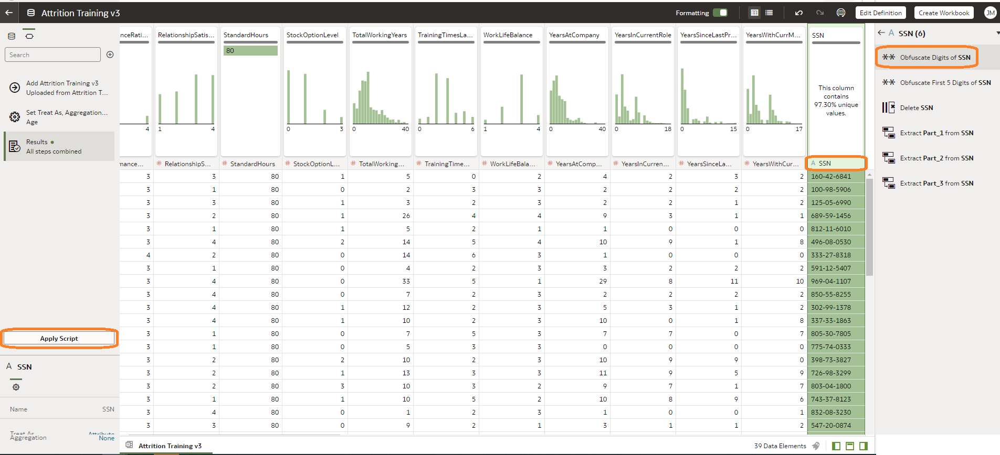    

    **Note**: these helpful Recommendations represent a key differentiator for Oracle and are designed to improve end user productivity while helping customers to get more out of their data. 
   
5. Now lets Create a Workbook using this dataset that we just enhanced dataset by clicking the "Create Workbook" button on the upper right hand side.

    

    A new workbook will be opened and the focus should be set on "Visualize" by default. If not simply choose "Visualize" at the top of the page

    

    In the "Data Elements" pane on the left hand side find the Attrition attribute, then Right Click on it and select “Explain Attrition”.

    

6. This  generates an Explain window that delivers insights regarding attrition.  These insights are divided into 4 categories. The first category identifies basic facts about our attrition attribute. In this case, it will perform automatic aggregations on the distinct rows.  

      

   Attrition being a binary variable “yes/no” presents a pie chart showing a breakdown of employees who did / didn't leave the company.   Scroll down to explore  additional charts generated during Explain. Any interesting insights you'd like to share or further analyze, can be selected simply by clicking on the tick mark in the top, right hand corner of each chart.  

     
   Navigate to the second tab, which identifies the key drivers related to the attrition attribute. Oracle Analytics leverages machine learning to identify those variables having the most deterministic relationship behind what is driving 'attrition'.  The bar graphs provide a distribution of attrition across each key driver.

    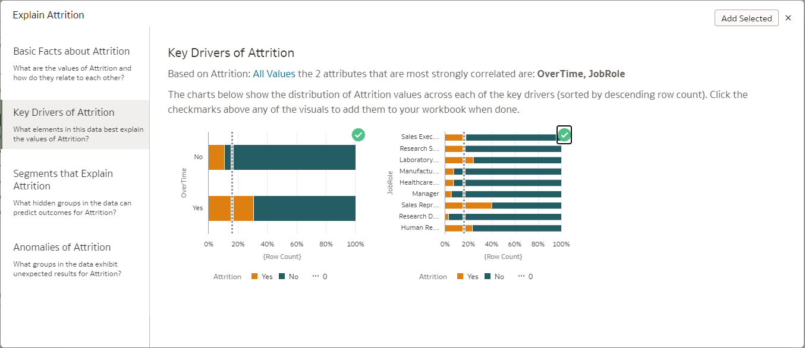  

   **Note**: Disregard order and screen placements of charts in explain.

   Explain also generates information on segments, identifying similarities, or grouping profile scenarios in which it is more or less likely  attrition will be a yes or a no.
    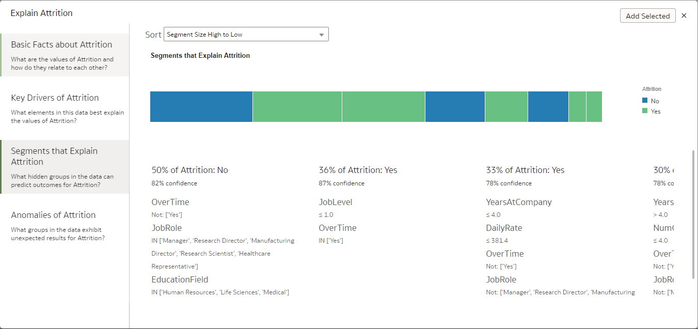    

    You can use the drop down to toggle through the different segment groupings to identify scenario confidence.

   The fourth insight category illustrates the anomalies of attrition or things perhaps unexpected. The anomaly designator indicates combinations of each distinct value of attrition against all columns in the dataset helping to highlight top outliers.  
    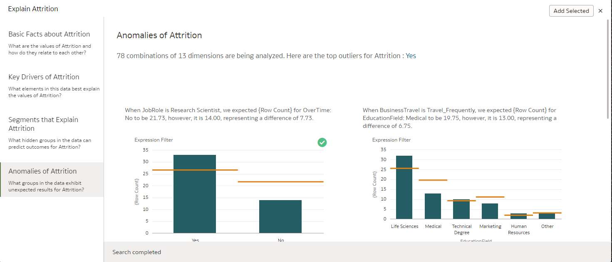    

    It visualizes the actual value, expected value and highlights the places where actual and expected value do not match.

   Select the following charts from the tabs surfaced by Explain:  

    - Attrition pie chart from the Basic facts about Attrition panel
    - JobRole  & Overtime from the Key Drivers of Attrition panel
    - JobRole  from the Anomalies of Attrition panel

    **Note**: you may need to hit Refresh View at the bottom of the Anomalies of Attrition panel to see all charts generated.

Now click the "Add Selected" on the upper right hand side to add these visualizations to your Workbook.  The end result should be a canvas named *Explain Attrition* containing each visualizations you selected that you can further explore or share.
 
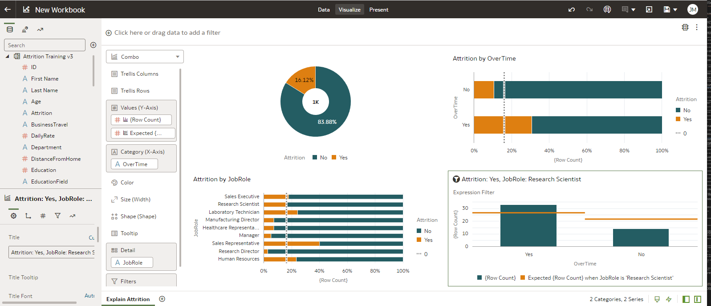  

7.  We can likewise execute explain other attributes or measures in our dataset. For each item you explain & select charts for, a new canvas will be added to the Workbook.  Try explaining the 'EducationField' attribute and select a few visualizations to create a new canvas.  

         

    Highlight the following charts Explained on the EducationField:

    - EducationField pie chart from the Basic facts about EducationField panel
    - Department and JobRole from the Key Drivers of EducationField panel  
    - Overtime anomalies chart from the Anomalies of EducationField panel

**Note**: you may need to hit Refresh View at the bottom of the Anomalies of EducationField panel to see all charts generated.

Click "Add Selected" and a new canvas for EducationField will be added to the Workbook helping to further enhance our understanding of attrition.  

Before going to the next lab, save this Workbook giving it a name such as *Attrition Analysis*

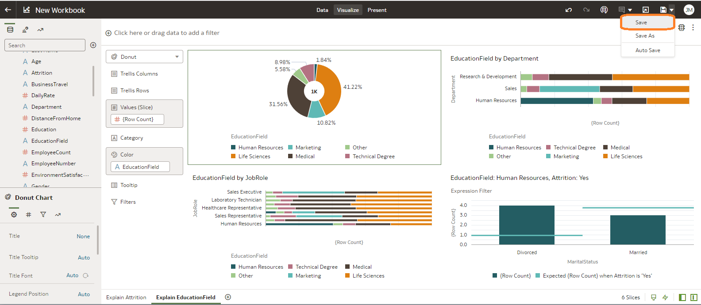     

8.  Lets further explore the dataset attrition. One item we've not analyzed extensively yet is gender. Add a canvas to your Workbook by clicking the + sign at the bottom of the screen and re-name the canvas "Gender Analysis".

    

    Use the Search bar near the top left hand side within the dataset panel to generate a visualization based on Gender:

    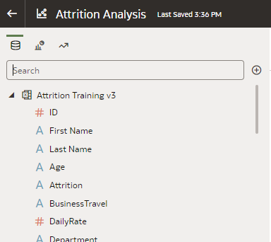    

    Search enables you to query your dataset and build visualizations based on measures and attributes you’re interested in. Type in the following column names: “EmployeeCount” and “Attrition” and “Gender”, selecting each one as it appears.  Search has a handy auto-complete feature, so often you only need to type in a portion of the column name to find it.  As each column surfaces, select it, adding it to the search bar. 

    Once you have all three columns showing in the search bar simply drag them onto the empty canvas or choose create visualization under the search bar resulting in a visualization as follows: 

    

    The end result should look something like this: 
   
    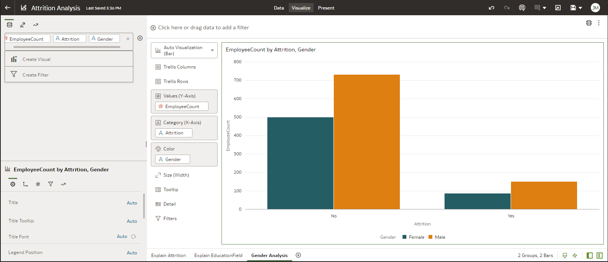   

    We see in raw numbers more men than women have left our organization.  Let's change the chart type to determine proportionally how many men vs  women have actually left. It's simple to change a chart type either by selecting a different chart using the chart icons on the upper right hand side of a chart or in the layout panel for the chart. Using either method, change the chart layout to be a horizontal 100% stacked bar chart. Then simply drag Gender to Category (X-Axis) and Attrition to Color so we can see what percentage of Male vs Female employees are leaving / staying as shown below:
 
       
   
    Now let's use a one-click advanced analytics feature to further investigate gender.  From the data elements panel use your computer's multi-select key to select *Gender*, *EnvironmentSatisfaction*, *WorklifeBalance* and *Last Name*. Then right-click and choose the *Scatter* chart. Finally, move *Gender* to Trellis Columns.  Your visualization should look like this:

    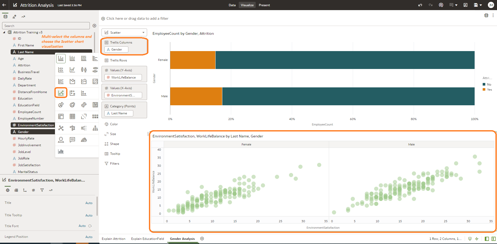

**Note**: you can simply drag a visualization above, below or beside any other visualization to order them as desired. 

From anywhere within the Scatter chart, right-click and choose *Add Statistics .. Outliers*.  Outliers will now be clearly highlighted using different colors for easy identification.
    

Looking at our non-outliers (which represents the majority) we can see that female employees seem to have both a lower EnvironmentSatisfaction and WorkLifeBalance as compared to their male counterparts. This may be a key factor in understanding what is causing women to leave our organization.

Save your analysis.

## Task 2: Leverage machine learning in Oracle Analytics Server to predict voluntary termination
This exercise will explore how self-service machine learning (ML) enables predictive analytics using  native ML models contained within Oracle Analytics Server. We are now going to extend our analysis by seeing how we can predict whether an employee is likely to leave the organization. For this we will be using a Binary Classification model. Before we venture any further let us try to understand briefly what binary classification is.  

Binary classification is a technique of classifying elements of a given dataset into two groups on the basis of classification rules for example Employee Attrition Prediction, i.e. whether the employee is expected to Leave or Not Leave. These classification rules are generated when we train a model using training dataset which contains information about the employees and whether the employee has left the company or not.

1. In the home page, click on create button and select Dataflow.

    

2. Select the dataset we were analyzing  “Attrition Training V3.” then click Add.

    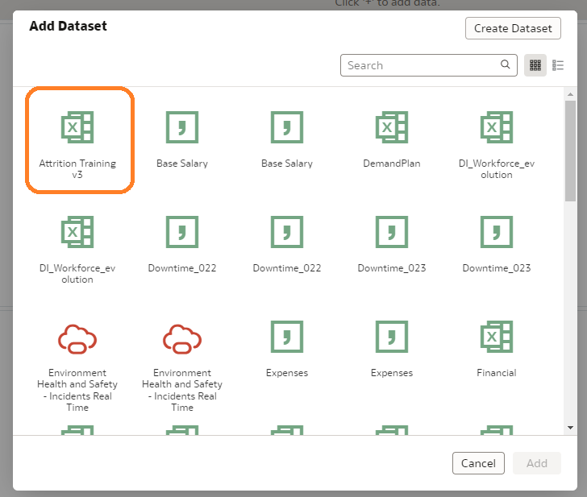

3. This data set will be added as a source for our data flow.

    

4. In the last example, we identified that there is attrition in our department and made note of some of the drivers identified using the explain function. What we want to do now is build and train a machine learning model in order to predict whether someone is likely to leave the organization. Let’s add a machine learning algorithm to our data flow.  

    Select the *plus icon* on the source data and select *Train Binary Classifier*.

    

5. Select *Naïve Bayes for Classification* and click OK.

    

6. Select the *Attrition* attribute as the target column for the model. Make sure positive class is *Yes* and leave the other options as the default settings.

    

7. Click *Save Model* and give the model a name like "AttritionPredict-BC-NB".

    

8. Save the flow as *AttritionPredict-BC-NB* or something similar

    

9.  Run the data flow once it has saved. Wait for the training process to complete.

    

10.  1 Exit the data flow.  2 From the Home landing page  3 Open the Machine Learning to review the results of the classification model.

     

11. We can inspect the validity of our Machine Learning model. Click on the dots along the right hand side and select "Inspect".

    

12. We can inspect the model to view more details like model quality (confusion matrix, precision, recall) and the generated datasets. The quality tab identifies the overall quality of the model with a series of related metrics: The overall model accuracy is 87% and the precision is 65%.

    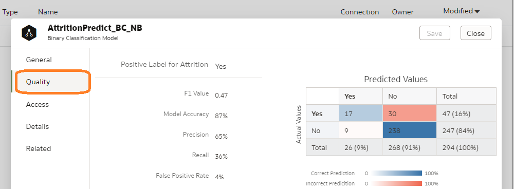

13. Since the model returned an accuracy score of 87%, let's apply that model to a dataset of employees who remain within our organization to see which of them might also be prone to leave. Click the three dots in the upper right hand side then select *Import Workbook/Flow* .  

    

14. From Documents / Live Lab Content directory,  select the *Employee-Analysis.dva* file. 

    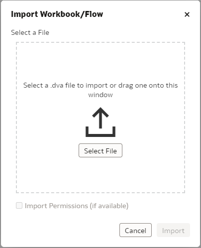

15. Enter the password *“Admin123”*.

    

16. Find and open the workbook named Employee Analysis. Here we have an existing workbook showing 470 employees within our organization. We’re going to apply our new classification training model to this data set which we imported with this workbook.

    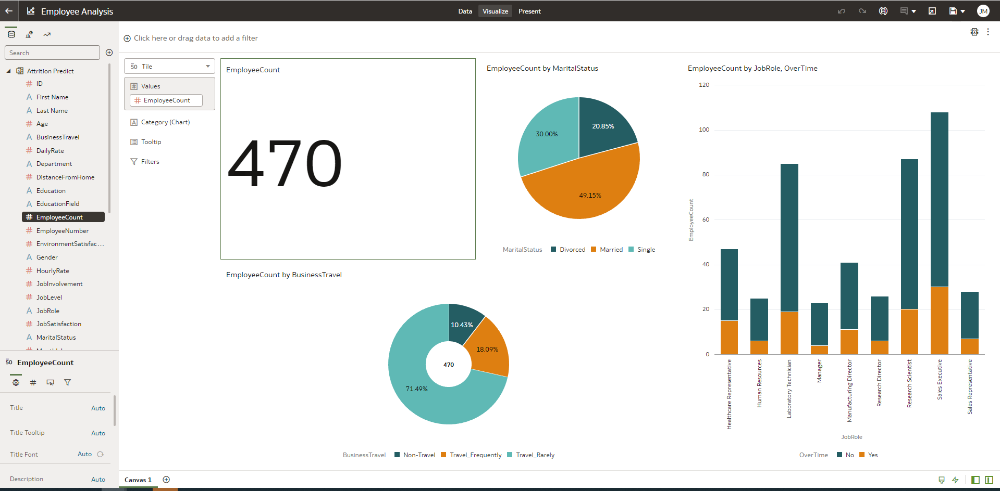  

17. Go to the home tab and create a new *data flow*.

    

18. Select this new data set “Attrition Predict”.

    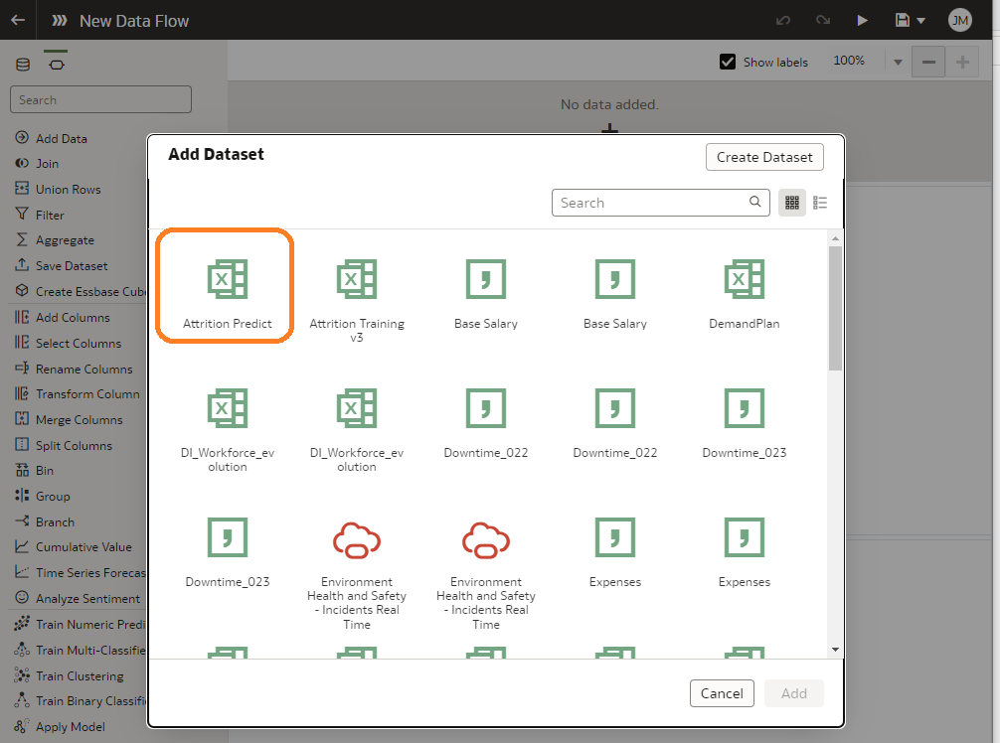

19. Select the *plus icon* to add a new node to the data flow.

    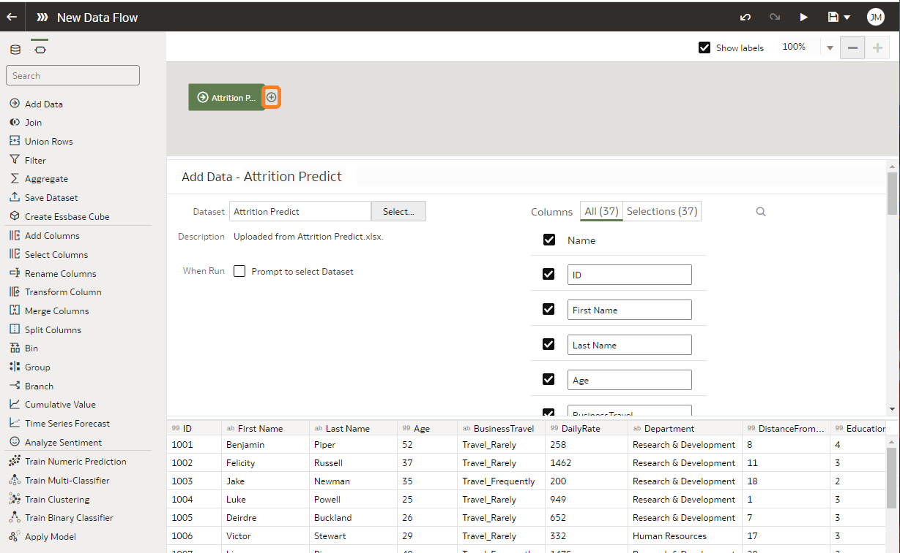

20. Select the *Apply Model* Node.

    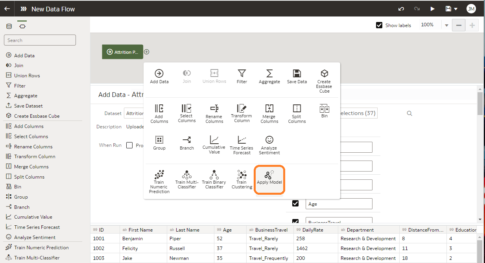

21. Select our Machine Learning Model from before and click OK.

    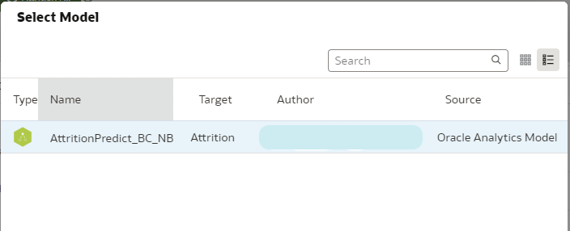

22. Our apply model node will have 3 sections.  

    - **Outputs** - this is a list of columns returned by the model in addition to the input columns. Applying the model will enrich our employee data set adding a predicted value and a prediction confidence score.
    - **Parameters** - optional parameters that users can pass to apply the model.
    - **Inputs** - these are the input columns for the apply model.  

    The apply model will try to automatically map the input dataset column names to the column names in the model.

      

23. Select the *plus icon* and select the *Save Data* node.

    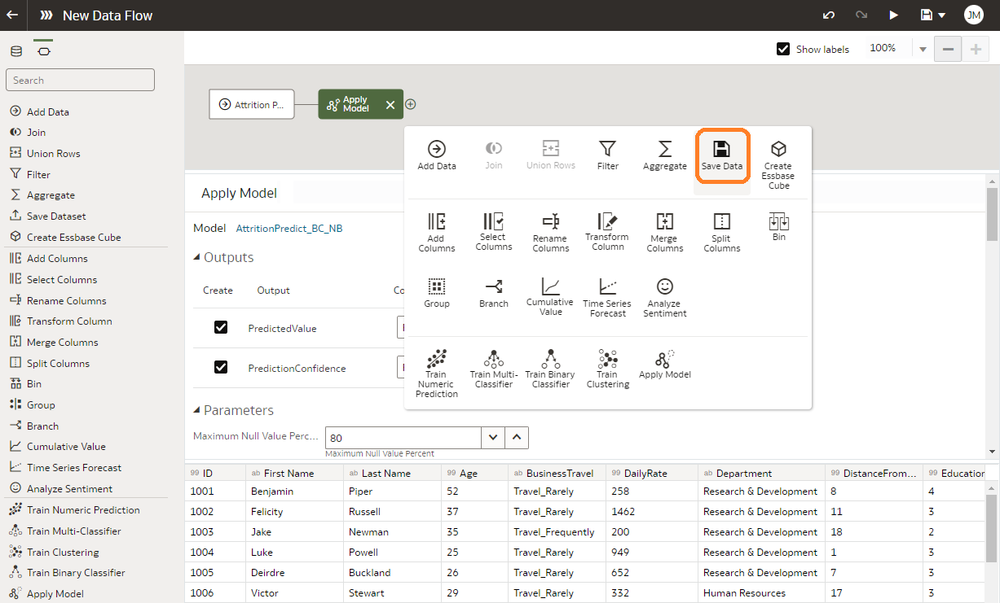

24. Give it the name “AttritionPredicted”.

         

    **Note**: We can run this data flow to an existing database if we like. For now, keep if as the default data set storage.

25. Save the data flow under the name “AttritionPredicted”.

    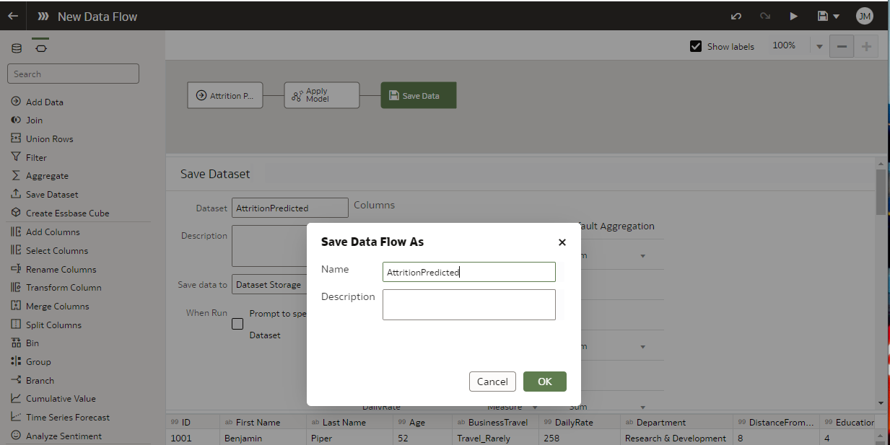

26. Once the data flow is saved, run the data flow.

        

    This will produce a new data set which appends the predicted values to our existing Attrition Apply data set.

27. Go to the data tab and select the new data set “AttritionPredicted”.

    

28. Some of the columns may be stored incorrectly. As we did in previous exercises, ensure that:

    - The following columns are stored as measures:
      - PredictionConfidence   
      - EmployeeCount  
    - Employee number is an attribute.  
  

      

    If you made any modifications, then click on Apply script.

29. Create some visualizations like the example here:  

    -	Performance Tile for EmployeeCount  
    -	Donut chart of EmployeeCount by JobRole and Department  
    -	Table of EmployeeNumber, First Name, Last Name, PredictionConfidence, PredictedValue.

    

30. Save the project as “AttritionPredicted”.

    

## Task 3: Leverage machine learning in Oracle Database to predict voluntary termination
This exercise will explore how to leverage Oracle database machine learning (OML) from Oracle Analytics Server.  The key difference compared to Task 2 being  we used a native machine learning model running in OAS to predict attriton.  While that approach works fine given limited amounts of data, it may not be optimal when working lots of data.   The Oracle database affords distinct performance advantages for hosting machine learning workloads which OAS simply cannot match.  The Oracle database is able to leverage in-memory constructs, parallel processing, sophisticated query plans, etc. to provide a highly robust environment for machine learning workloads. It's also common in the industry to have a professional development team train, test, evaluate and deploy machine learning models in a robust dedicated compute environment such as the Oracle database.  So our goal in task 3 is to illustrate how an analyst can easily and readily leverage machine models hosted in the Oracle Database from Oracle Analytics Server.

In this scenario we will begin by registering a machine learning model which our professional data scientists have previously trained, tested and deployed to the Oracle database.  Once registered, we will call this model to have it make a prediction of who in our organization might be likely to leave the organization. 

Some of the pre-work required to achieve this task are done for us already, just as it would be given a real-world scenario.  That work includes:
- A connection to the Oracle database is pre-configured
- The machine learning model we will call to make our predictions has been pre-trained 
- The employee data needed to predict who else might leave our organizaton is already in our Oracle database 
 **Note**: in order to fully leverage OML capabilities both the machine learning model and data needed to make a prediction must be in the Oracle database.  

1. From the browser session you started in [Lab: Initialize Environment](?lab=init-start-oas), go to the landing page and along the upper right hand side click the three vertical dots to open the drop down menu then select Register ML Model.

    

2. Select the OML Conn connection that has been pre-configured

    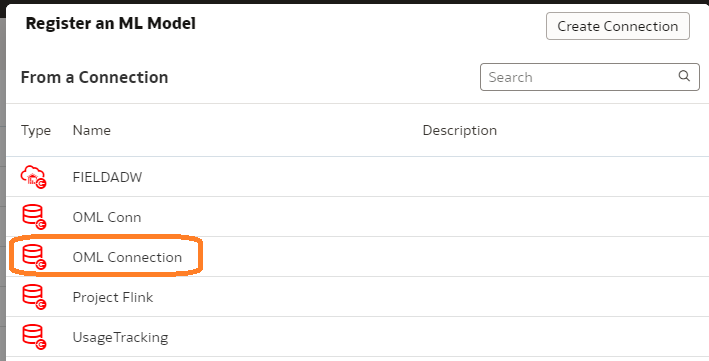

3. Now select the "*ATTRITION-MODEL-SVM*" from the list of available machine learning models and click Register at the bottom

    

4. From the landing page click the hamburger button on the upper left hand side, select Machine Learning and for the ATTRITION-MODEL-SVM that we just registered select the Inspect option using the three vertical dots which appear along on the right hand side of the model.

    

5. Inspect the registered model. Notice there is more metadata surfaced about OML models hosted in the Oracle database as compared to native ML models hosted in OAS.   This speaks to the fact that OML models are far more sophisticated.  Browse through the various tabs (General, Access, Details, Related)  Notice under Details - Output Columns there is a Prediction and PredictionProbability which will tell us who is likely to leave next. Likewise, the Related tab offers a series of underlying metadata stored in DM$ views within the Oracle database containing signficant details regarding how the model was trained, tested and scored. Optional: Take a look at videos 8-10 in this series  [ https://bit.ly/OAC59Features.html ] to see how available metadata helps to enrich your understanding of an OML model.  When you are finished inspecting the model, close the Inspect dialog box.

    

6. Our registered OML model is now ready to be called by OAS in order to make predictions regarding the employees who are prone to leave the organization. To call this registered OML model, **Click**  Create at the top right hand side of the page then choose Data Flow. 
    
    

7. The create dataflow will prompt you for what dataset(s) you wish to work with.  Type "EMP" into the Search window then select EMPLOYEE-DATA then Add to bring in a dataset containing key information about the remaining employees who still work for our organization. 
    
    

8. Click the + sign to the right of the EMPLOYEE-DATA node we just added to the dataflow and choose  Apply Model near the bottom of the items presented. 
    
    

9. Select ATTRITION-MODEL-SVM which we registerd in step 3 above then click OK. 
    
    

10. Because a similar dataset was used to train and test our model, the Prediction and PredictionProbability outputs are automatically mapped along with the input columns needed to create our predictions.  
    
    

11. Click the + sign to the right hand side of the Apply Model node and choose Save Data 
        
    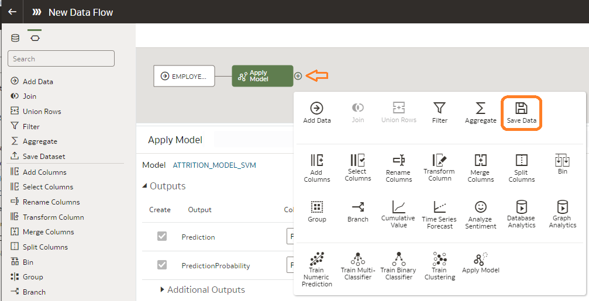

12. Save Data will automatically attempt to name the dataset New Dataset1. Because this is an invalid table name in an Oracle Database you may see an error stating "Table name is invalid".  You need to change the name to something like PRED-EMP-ATTRIT.  There seems to be a bug as even after changing the Table name to a valid value the error will not go away.  Ignore this error and click the Save As option along the top right hand side of the page.
        
    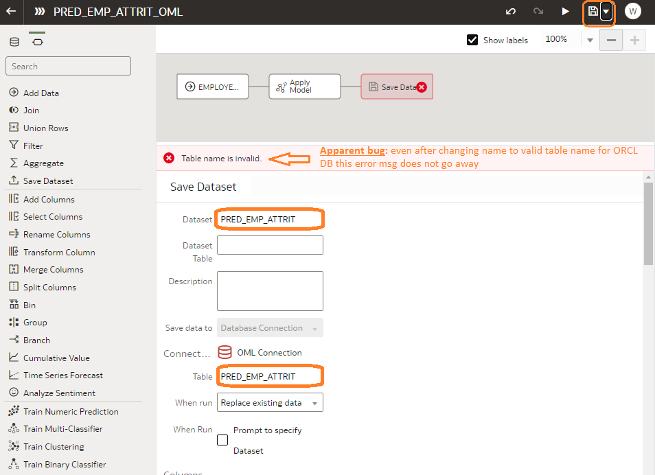

13. Save your dataflow naming it PRED-EMP-ATTRIT-OML then using the arrow at the top right hand side of the page run the dataset to create the predictions.  After running the dataflow the "Table name is invalid" should go away.  Close the dataflow. 
        
     

14. Using the hamburger icon on the top left hand side of the page open the DATA panel and input EMP to see all datasets containing "EMP" in their name.  Click on the PRED-EMP-ATTRIT dataset to create a new workbook.
        
    

15. Using your multi-select key select all columns from the dataset, right click and select Pick Visualization.  Then choose the Table visualization to view the predictions.
        
    

16. Using drag and drop rearrange the columns comprising each row so that Prediction, PredictionProbability and EMPLOYEENUMBER appear on the right hand side of the table.  You may also wish to move key attributes such as DEPARTMENT, JOBROLE, ... to the right hand side as well. 
       
    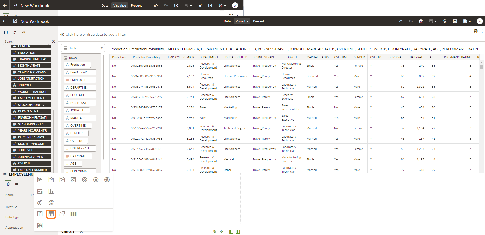

17. Click on just the Prediction attribute and drag it to the Filters section at the top of the page then filter on only those employees where the prediction is Yes meaning they are likely to leave.   Then sort based on PredictionProbability  high to low to see those employees having the highest risk of leaving.  
       
    

17. Continue building visualizations  you think might help in understanding the attrition predictions till you get a canvas that looks interesting.  
       
    

**This concludes this lab.**

## Learn More
* [Oracle Analytics Server Documentation](https://docs.oracle.com/en/middleware/bi/analytics-server/index.html)
* [https://www.oracle.com/business-analytics/analytics-server.html](https://www.oracle.com/business-analytics/analytics-server.html)
* [https://www.oracle.com/business-analytics](https://www.oracle.com/business-analytics)

## Acknowledgements
* **Authors** - Diane Grace, Manager, Analytics Platform Specialist Team, NA Technology
* **Contributors** - Linda Dest, John Miller, Rene Fontcha
* **Last Updated By/Date** - Rene Fontcha, LiveLabs Platform Lead, NA Technology, April 2022
