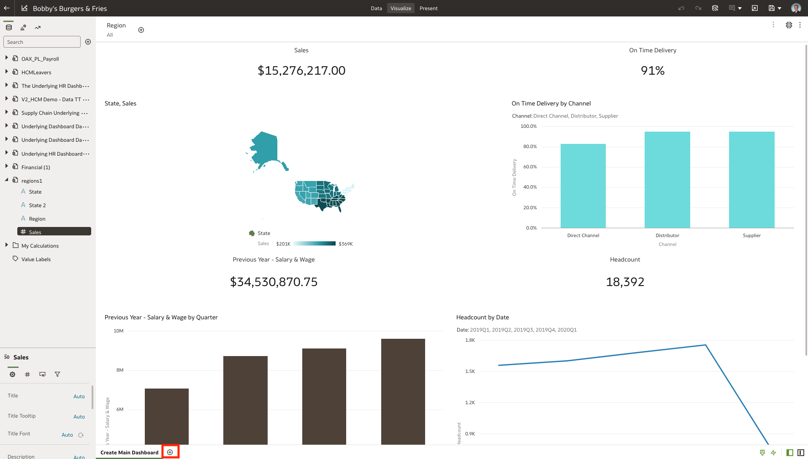

# Analyze Channel Sales

## Introduction

This lab walks you through the steps to better understand sales performance through visualizations that blend data from ERP, CX, and POS.

Estimated Time: 30 minutes

### Objectives

Today, we will be utilizing Oracle Analytics Server to pull cross-functional data together from across your entire business and to report on it in a single place, leveraging data sets and best practice KPIs. You can also extend the data model using any external data sources when utilizing governed, self-service, and augmented capabilities to run analysis. For the purpose of this lab, we will be highlighting its self-service capabilities by creating some quick visualizations to configure a functioning dashboard.

In this lab, you will:
* Create a stacked bar chart to look at the different break down of sales by channel.
* Create a treemap to look at the different break down of menu items.
* Create bar chart to look at the different amount of sentiment.
* Create tag cloud to look at the top survey responses.
* Analyze sentiment to look at what kind of sentiment impact sales.

### Prerequisites

This lab assumes you have:
* An Oracle account
* All previous labs successfully completed

## **Task 1:** Create Stacked Bar Chart

1. **Select** the plus symbol to open an empty canvas so we can build out our visualizations.

    

2. **Rename** the canvas by tapping the arrow, and hitting 'rename'. Rename the canvas to **'Analyze Channel Sales'**

    

3. First, let’s see how sales are split across the different channels within the **'Underlying DashBoard Data - 1.'**

    * **Control select** and choose **'Sales'** by **'Channel'** and then navigate to **'Quarter'** within Date

    * **Right click** and select **'Stacked Bar Chart.'**

    

    

    Now, we can see the sales broken down by each individual channel for the past couple of quarters. In Store and Delivery seem to be the biggest contributors to sales, but we need to investigate these values further.

    

4. Next, let's filter out the years that are not relevant to the visual by dragging Date(Quarter) to the filter tab and **select** quarters that are available from 2020 - 2021.

    

    Now, we have the correct stacked bar chart of sales by channel!

## **Task 2:** Create a Treemap

1. On the same dashboard, let's continue visualizing the dataset by inspecting survey data that was collected.

    * **Control select** and choose **'Menu Items by Survey Count'**, the same way we did previously.
    * **Right click** and choose **'Treemap'**.
    * Make sure to also drag "Menu Items" to color in order to color code the top responses.

    

    

    We now have a visual that breaks down the different surveys we collect by menu items. We can see that our top 5 menu categories, where fries and hamburger meals top the list - not surprising as this QSR is known for their fries.

## **Task 3:** Create a Bar Chart

1. From these survey responses, let's continue by analyzing the different kinds of sentiment that was derived.

    * **Control select** and choose **'Derived Sentiment'** and **'S-Counter'**,
    * **Select** the **Create Best Visualization** option.

    This will autonomously create a Bar Chart for us based on the metrics selected. Also make sure to filter out any nulls in this visual and the next if you have them.

    

    

    Now, we have a visual that breaks down the different instances of each sentiment.

## **Task 4:** Create a Tag Cloud

1.  Let's finish up by creating a tag cloud to summarize the leading responses to each customer sentiment.

    * **Control select** and choose **'Survey Count'** and **'Actual Sentiment.'**
    * **Select** 'pick visualization' and choose **Tag Cloud**.

    

    Make sure to also drag **'Derived Sentiment'** to color in order to color code by sentiment.

    

    With this change, we see the representations of sentiment by color: **red** for "Negative," **yellow** for "Neutral," and **green** for "Positive." Now, we have a visual that breaks down the top responses of customer surveys such as 'Always Out of Fries', 'Long Wait Time', and 'Beats My Cooking' by sentiment.

    

## **Task 5:** Analyze Sentiment

1. Let's wrap up this dashboard with a quick encompassing filter that can help us interact with the different sentiments.

    * **Select** the hamburger menu at the top right of the bar chart in the bottom left corner.
    * **Select** the **Use as Filter** option.

    

2. Next we can **select** 'Negative' bar to bring up only negative sentiment results from the dashboard. This shows all the relevant information within the dashboard that has a negative sentiment, revealing the key responses for it - **'Long Wait Time'** and **'Always Out of Fries'**.

    

    **In Summary** - Customer survey responses are displayed in the bottom two visualizations within the dashboard. The detail on the left showing the leading indicators of customer sentiment from the 1100 survey responses in the last week - fortunately, as we see on the right most surveys are positive or neutral, but there are also a large amount of negative responses mostly around long wait times and being out of fries, not good. But, glad to see people prefer our cooking over their own in our retail stores!

    

4. Now that we have completed our Channel Sales Dashboard, you may now **proceed to the next lab**.

## Learn More
* [Oracle Analytics Server Documentation](https://docs.oracle.com/en/middleware/bi/analytics-server/index.html)
* [https://www.oracle.com/business-analytics/analytics-server.html](https://www.oracle.com/business-analytics/analytics-server.html)
* [https://www.oracle.com/business-analytics](https://www.oracle.com/business-analytics)

## Acknowledgements

* **Authors** - Killian Lynch, Nagwang Gyamtso, Luke Wheless, Akash Dharamshi, Solution Engineer Specialist Hub Team, NA Technology
* **Contributors** - Luke Wheless, Solution Engineer Specialist Hub Team, NA Technology
* **Last Updated By/Date** - Luke Wheless, April 2022
